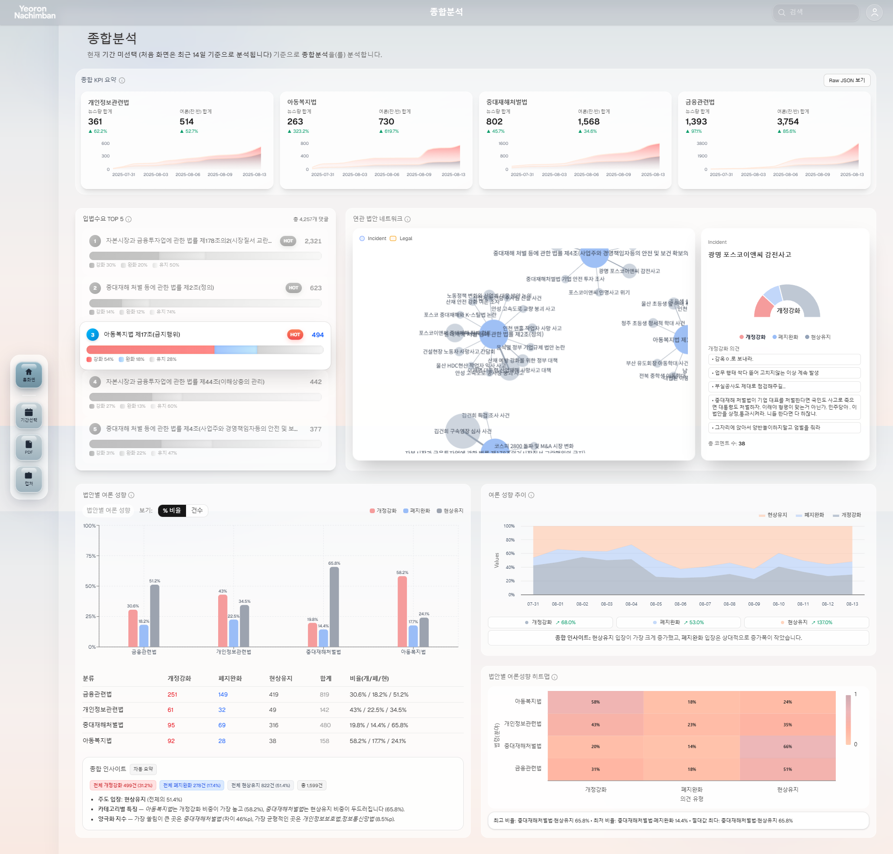

## 뉴스 및 소셜 데이터를 활용한 AI 입법 수요 분석 서비스 개발 프로젝트
> <span style="color: gray;">
> 본 프로젝트에서는 뉴스 및 소셜 데이터를 AI 기술로 분석하여 입법 수요를 선제적으로 탐지하고 정량화하는 End-to-End 자동화 서비스를 개발했습니다.  
> RAG 아키텍처를 도입하여 복잡한 법률 조항을 자동 매핑하는 핵심 문제를 해결했으며, 4-Class 여론 분류 모델로 정책 방향성을 구체적으로 제시합니다.  
> 또한, 6가지 다각적 지표(IIS)를 통해 이슈의 중요도를 객관적으로 산정하고, 모든 분석 결과를 웹 대시보드로 시각화하여 데이터 기반의 신속한 입법 및 정책 결정을 지원하는 기술적 토대를 마련했습니다.
> </span>
</br>

- 대회일정: 2025. 07.14(월) ~ 12. 03(수)
- 대회목적: 데이터와 AI 기반의 사회·과학 문제 해결로 국내 연구데이터 생태계 저변을 확대
- 주최: 국가과학기술연구회, 대전광역시, 해양경찰청, 국회도서관, 대전중구청
- 주관: 한국과학기술정보연구원(KISTI)
- 후원: (사)한국콘텐츠학회
- 목표: 뉴스 및 소셜 데이터를 활용한 AI 입법 수요 분석 서비스 모델 개발
- 역할: 대시보드(프론트) 구현
---
### Overview
1.  배경 및 필요성
산업 영역: 입법 기관 및 정책 수립 지원
주요 니즈(Pain Point): 데이터 홍수 속 정보 빈곤
방대한 비정형 여론 데이터의 체계적 수렴 및 분석 부재
실시간 사회 이슈 및 관련 입법 수요 파악의 어려움
핵심가치: 주관적 판단이나 일부 목소리에 의존하던 기존 방식을 넘어, 객관적인 데이터 분석을 통해 국민의 의견을 신속하고 정확하게 정책에 반영하는 기술적 토대를 마련한다

2.  문제점 및 해결 목표
기존 방식의 문제점
수작업의 한계: 비정형·파편화된 여론 데이터 분석에 막대한 시간과 비용 소모
단순 분석의 한계: 단순 찬반 분류로는 구체적인 정책 방향성 파악 불가
객관성의 부재: 이슈의 중요도와 시급성을 객관적으로 평가하기 어려움
목표
뉴스 데이터 구조화 및 핵심 이슈 자동 탐지
뉴스 기사를 AI 모델로 분석하여 대분류>중분류 순으로 자동분류
분류된 중분류 내에서 의미 기반 클러스터링을 통해 구체적인 이슈(소분류) 탐지
이슈-법률 자동 매핑 및 여론 심층 분석
탐지된 이슈의 대표 기사를 RAG 모델에 입력하여 관련 법 조항을 자동으로 매핑 
해당 이슈에 대한 댓글을 '개정 강화', '폐지/완화', '현상 유지', '중립'의 4가지 입장으로 심층 분류
객관적 중요도 산정 및 시각화
미디어 지표와 대중 반응 지표를 종합한 다각적 평가지표(IIS)를 기반으로 사회적 중요도를 산정하여 Top-5 핵심 법안을 도출
분석 결과를 사용자가 직관적으로 파악할 수 있는 웹 대시보드로 제공

3.  프로젝트 기간 및 인원
- 일정: 2025.08.29 - 2025.11.10 (총 12주)
- 인원: 4명
---
### Demo 
https://youtu.be/rvLSk8aTsyQ

---
### Stack
   

---
### Project Structure
```
 src/
 ├─ app/
 │   └─ page.tsx
 │
 ├─ features/
 │   └─ total/
 │       ├─ components/
 │       │   ├─ KpiSummary.tsx
 │       │   ├─ LegalTop5.tsx
 │       │   ├─ NetworkGraph.tsx
 │       │   ├─ NetworkGraphContainer.tsx
 │       │   ├─ SocialBarChart.tsx
 │       │   ├─ LegislativeStanceArea.tsx
 │       │   └─ Heatmap.tsx
 │       └─ hooks/
 │           ├─ useKpiSummary.ts
 │           ├─ useLegalTop5.ts
 │           ├─ useNetworkGraph.ts
 │           ├─ useSocialBar.ts
 │           ├─ useStanceArea.ts
 │           └─ useHeatmap.ts
 │
 ├─ shared/
 │   ├─ api/
 │   │   ├─ client.ts
 │   │   └─ dashboard.ts
 │   ├─ constants/
 │   │   └─ mapping.ts
 │   ├─ types/
 │   │   ├─ common.ts
 │   │   └─ dashboard.ts
 │   └─ utils/
 │       ├─ date.ts
 │       ├─ format.ts
 │       └─ insights.ts
 │
 └─ shared-ui/
     └─ HalfPieChart.tsx 
```
---
### Screenshots

- KPI Summary
    -  사용자 지정 기간 단위로 뉴스/여론 지표 누적 추이 시각화
    -  Recharts AreaChart 기반의 시계열 그래프 구성
-LegalTop5
    -  여론분포(개정강화/폐지완화/현상유지) 중 가장 뜨거운 관심을 받은 상위 5개 법조항 기준으로 시각화
    -  자동 슬라이드 애니메이션으로 랭킹 순위 강조
- NetworkGraph
    -  법조항-사건 관계를 2D 네트워크 그래프로 표시
    -  React-force-graph-2d 의 Force Simulation 으로 노드 간 관계를 동적으로 표현
- SocialBarChart
    -  법안별 여론 입장(개정강화/폐지완화/현상유지)을 누적 막대그래프로 표시
    -  비율/건수 모드를 토글하여 시각화 방식 전환 가능
- LegislativeStanceArea
    -  기간별 여론성향의 비율 변화를 시계열 면적 그래프로 시각화
    -  Highcharts의 Percent Stacked Area Chart를 활용하여 각 입장의 상대적 비중 변화를 직관적으로 표현
    -  useMEmo로 증감률 및 요약 인사이트를 계산하여 렌더링 성능을 최적화
    -  차트 하단에는 항목별 증감률 및 주요 인사이트를 텍스트로 요약 표시
- Heatmap
    -   법안별 입장 분포를 색상강도로 시각화
    -  HighCharts  Heatmap 모듈 기반